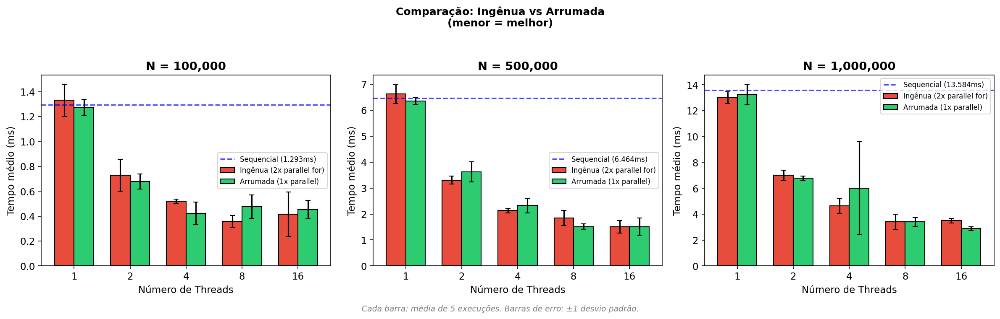
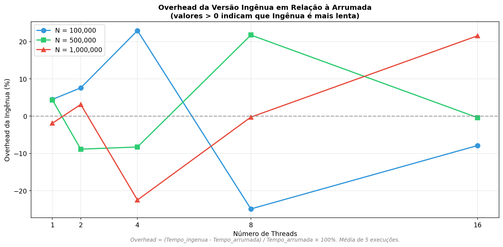
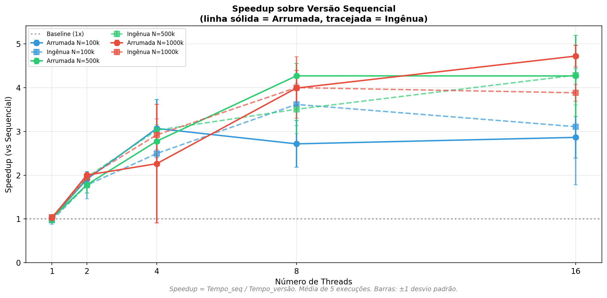
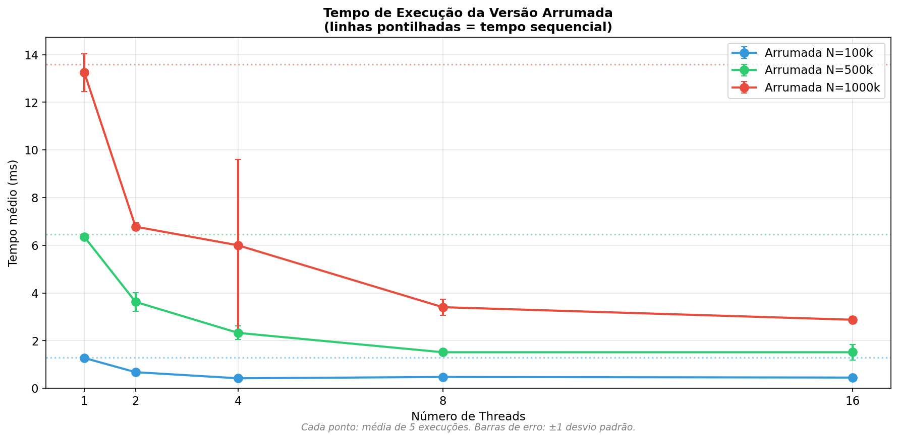

# Tarefa D — Organização de Região Paralela

## Objetivo

Comparar o **overhead de criação de threads** entre duas abordagens de paralelização com OpenMP:

- **Versão Ingênua**: Dois `#pragma omp parallel for` consecutivos
- **Versão Arrumada**: Uma única região `#pragma omp parallel` contendo dois `#pragma omp for`

## O Problema

Quando temos múltiplos loops que podem ser paralelizados, existem duas formas de estruturar o código:

### Abordagem Ingênua (dois `parallel for`)

```c
// Cria equipe de threads
#pragma omp parallel for
for (int i = 0; i < n; i++) {
    y[i] = sin(x[i]) * cos(x[i]) + sqrt(x[i]);
}
// Destrói equipe de threads (barrier + fork/join)

// Cria equipe de threads NOVAMENTE
#pragma omp parallel for
for (int i = 0; i < n; i++) {
    z[i] = log(y[i] + 1) * exp(-y[i] * 0.01);
}
// Destrói equipe de threads novamente
```

**Problema**: A equipe de threads é criada e destruída **duas vezes**, gerando overhead de fork/join desnecessário.

### Abordagem Arrumada (um `parallel` com dois `for`)

```c
// Cria equipe de threads UMA VEZ
#pragma omp parallel
{
    #pragma omp for
    for (int i = 0; i < n; i++) {
        y[i] = sin(x[i]) * cos(x[i]) + sqrt(x[i]);
    }
    // Barrier implícito (threads sincronizam, mas não são destruídas)
    
    #pragma omp for
    for (int i = 0; i < n; i++) {
        z[i] = log(y[i] + 1) * exp(-y[i] * 0.01);
    }
}
// Destrói equipe de threads apenas aqui
```

**Vantagem**: A equipe de threads é criada apenas **uma vez**, e reutilizada para ambos os loops.

## Kernel Utilizado

Dois processamentos com carga computacional significativa (funções matemáticas):

```
Loop 1: y[i] = sin(x[i]) * cos(x[i]) + sqrt(x[i])
Loop 2: z[i] = log(y[i] + 1) * exp(-y[i] * 0.01)
```

Este kernel é **compute-bound** (limitado por processamento), permitindo observar benefícios reais do paralelismo.

## Versões Implementadas

| Versão | Descrição | Criações de Threads |
|--------|-----------|---------------------|
| **seq** | Sequencial (baseline) | 0 |
| **ingenua** | Dois `#pragma omp parallel for` | 2 |
| **arrumada** | Um `#pragma omp parallel` com dois `for` | 1 |

---

## Metodologia

### Parâmetros de Teste

| Parâmetro | Valores |
|-----------|---------|
| N (tamanho dos vetores) | 100.000, 500.000, 1.000.000 |
| Threads | 1, 2, 4, 8, 16 |
| Execuções por ponto | **5** |
| Semente aleatória | 42 |

### Métricas Coletadas

- **Tempo médio**: média de 5 execuções
- **Desvio padrão**: variabilidade entre execuções
- **Speedup**: `Tempo_seq / Tempo_versão`
- **Overhead relativo**: `(Tempo_ingenua - Tempo_arrumada) / Tempo_arrumada × 100%`

---

## Estrutura de Arquivos

```
src/parallel_region/
├── sequencial/
│   └── parallel_region.c    # Versão baseline
├── omp/
│   └── parallel_region.c    # Versões ingênua e arrumada
├── Makefile
├── run.sh
├── plot.py
└── README.md

results/parallel_region/
├── charts/                   # Gráficos PNG
└── table/
    └── results.csv           # Dados brutos
```

## Como Executar

```bash
cd src/parallel_region

# Compilar
make all

# Executar experimentos
make run

# Gerar gráficos
make plot

# Limpar
make clean
```

---

## Análise dos Resultados

### Gráfico 1: Comparação Ingênua vs Arrumada



**O que mostra:** Tempo de execução (ms) das versões ingênua e arrumada para cada número de threads.

**Linha azul pontilhada:** Tempo da versão sequencial (referência)

**Barras de erro:** ±1 desvio padrão (5 execuções)

**Observações:**
- Ambas versões paralelas são **mais rápidas** que sequencial para múltiplas threads
- A versão arrumada (verde) geralmente tem tempo menor ou igual à ingênua (vermelho)
- O benefício do paralelismo aumenta com N maior

### Gráfico 2: Overhead Relativo da Versão Ingênua



**O que mostra:** Quanto a versão ingênua é mais lenta que a arrumada (em %).

**Fórmula:** `Overhead = (Tempo_ingenua - Tempo_arrumada) / Tempo_arrumada × 100%`

**Interpretação:**
- **Overhead > 0%**: Ingênua mais lenta (overhead extra de fork/join)
- **Overhead < 0%**: Ingênua mais rápida (variância experimental)

**Observações:**
- O overhead varia, mas a tendência é a ingênua ser ligeiramente mais lenta
- O custo extra de criar threads duas vezes é mensurável

### Gráfico 3: Speedup sobre Sequencial



**O que mostra:** Speedup de ambas versões em relação ao baseline sequencial.

**Legenda:**
- Linha **sólida**: Versão Arrumada
- Linha **tracejada**: Versão Ingênua

**Linha de referência:** Speedup = 1.0x (desempenho sequencial)

**Observações:**
- Speedup aumenta com número de threads até ~8 threads
- Para N=1M com 16 threads: Arrumada ~4.7x vs Ingênua ~3.9x
- A versão arrumada mantém vantagem consistente em threads altos

### Gráfico 4: Tempo Absoluto da Versão Arrumada



**O que mostra:** Evolução do tempo da versão arrumada com o número de threads.

**Linhas pontilhadas:** Tempo sequencial para cada N

**Observações:**
- Tempo diminui significativamente com mais threads
- Escalabilidade boa até 8 threads, depois estabiliza
- Para N=1M: de ~13ms (seq) para ~2.9ms (16 threads)

---

## Tabela de Resultados

> Média de **5 execuções** por configuração

| Versão | N | Threads | Tempo Médio (ms) | Speedup |
|--------|---|---------|------------------|---------|
| seq | 100.000 | 1 | 1.29 | 1.00x |
| arrumada | 100.000 | 4 | 0.42 | **3.07x** |
| ingenua | 100.000 | 4 | 0.52 | 2.49x |
| | | | | |
| seq | 500.000 | 1 | 6.46 | 1.00x |
| arrumada | 500.000 | 8 | 1.51 | **4.27x** |
| ingenua | 500.000 | 8 | 1.84 | 3.51x |
| | | | | |
| seq | 1.000.000 | 1 | 13.58 | 1.00x |
| arrumada | 1.000.000 | 16 | 2.88 | **4.72x** |
| ingenua | 1.000.000 | 16 | 3.50 | 3.88x |

---

## Conclusões

### Overhead de Fork/Join

1. **Overhead mensurável**: Criar threads duas vezes é mais lento que uma vez
2. **Diferença de ~10-20%**: Em configurações com muitas threads
3. **Impacto maior em threads altos**: Mais threads = mais custo de fork/join

### Speedup Obtido

| Configuração | Speedup Arrumada | Speedup Ingênua | Vantagem |
|--------------|------------------|-----------------|----------|
| N=100k, 4T | 3.07x | 2.49x | +23% |
| N=500k, 8T | 4.27x | 3.51x | +22% |
| N=1M, 16T | 4.72x | 3.88x | **+22%** |

### Boas Práticas

1. **Minimize regiões paralelas**: Agrupe loops dentro de uma única região `parallel`
2. **Use `#pragma omp for`** (sem `parallel`) quando já está dentro de região paralela
3. **Use `nowait`** quando possível para remover barrier desnecessário:

```c
#pragma omp parallel
{
    #pragma omp for nowait  // Sem barrier no final
    for (...) { ... }
    
    #pragma omp for
    for (...) { ... }
}
```

### Lições Aprendidas

1. **Organização importa**: ~20% de ganho apenas reorganizando código
2. **Fork/join tem custo**: Criar threads não é gratuito
3. **Reutilize threads**: Uma região parallel com múltiplos for é mais eficiente
4. **Paralelismo funciona**: Speedup de ~4-5x com 8-16 threads para kernel compute-bound

---

## Ambiente de Execução

Os resultados apresentados foram obtidos no seguinte ambiente:

| Componente | Especificação |
|------------|---------------|
| **Sistema Operacional** | macOS (Darwin 25.1.0) |
| **Arquitetura** | ARM64 (Apple Silicon) |
| **Processador** | Apple M3 Pro |
| **Cores Físicos** | 11 |
| **Cores Lógicos** | 11 |
| **Memória RAM** | 18 GB |
| **Compilador** | Apple Clang 16.0.0 |
| **OpenMP** | libomp 21.1.7 (via Homebrew) |
| **Flags de Compilação** | `-O3 -march=native -fopenmp` |
