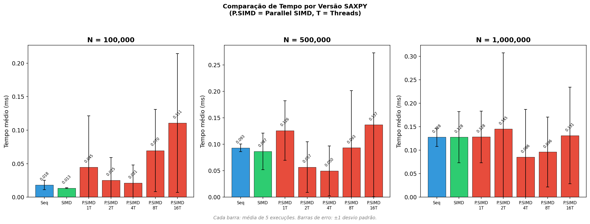
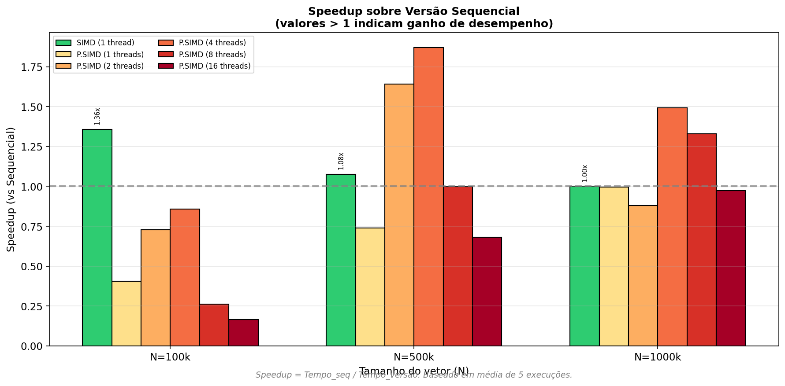
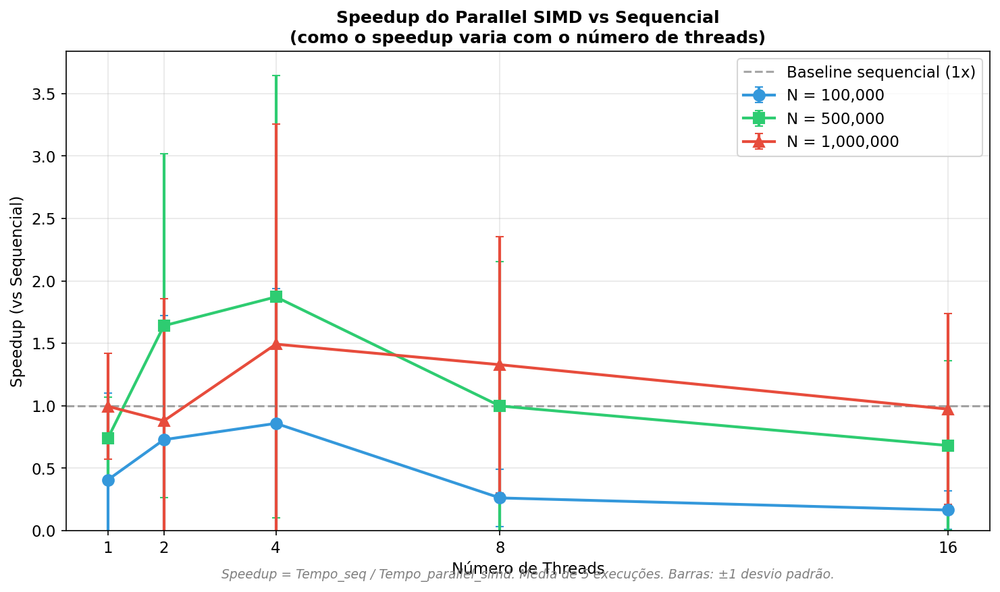
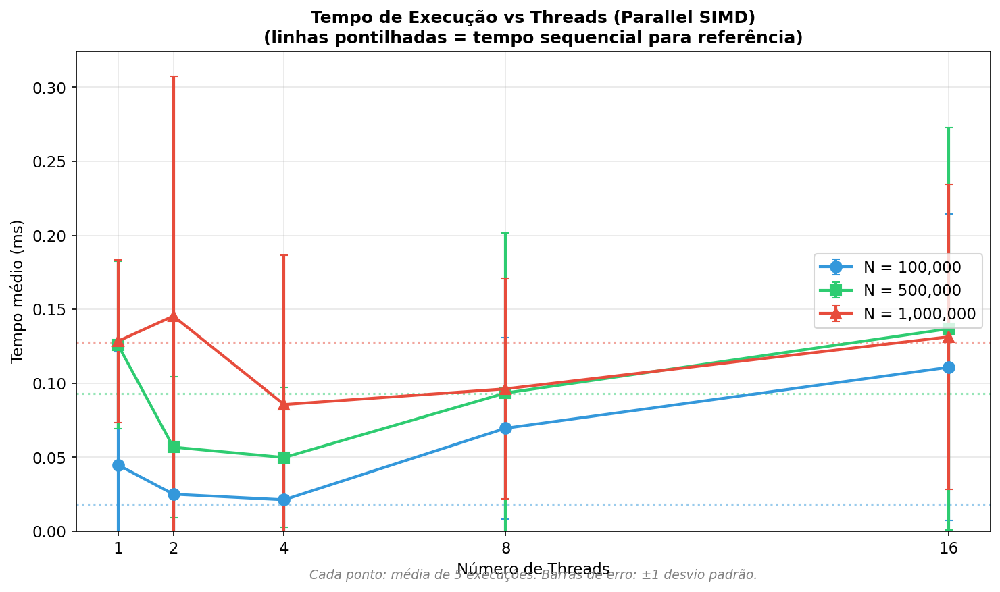

# Tarefa C — Vetorização com SIMD

## Objetivo

Implementar e avaliar versões paralelas da operação **SAXPY** usando OpenMP, com foco em:

- Vetorização explícita com `#pragma omp simd`
- Combinação de paralelismo de threads com vetorização (`#pragma omp parallel for simd`)
- Análise de ganhos e limitações da vetorização

## O que é SAXPY?

SAXPY (*Single-precision A·X Plus Y*) é uma operação fundamental de álgebra linear definida como:

```
y[i] = a * x[i] + y[i]
```

Onde:
- `a` é um escalar (constante = 2.5)
- `x` e `y` são vetores de ponto flutuante (`float`)
- A operação é aplicada elemento a elemento

Esta operação é um exemplo clássico de computação **memory-bound** (limitada por memória), pois a intensidade aritmética é baixa: apenas 2 operações de ponto flutuante (multiplicação + soma) para cada 3 acessos à memória (2 leituras + 1 escrita).

## Versões Implementadas

### V1: Sequencial (`seq`)
Implementação básica com um loop sequencial simples.

```c
void saxpy_seq(float a, float *x, float *y, size_t n) {
    for (size_t i = 0; i < n; i++) {
        y[i] = a * x[i] + y[i];
    }
}
```

### V2: SIMD (`simd`)
Vetorização explícita usando a diretiva `#pragma omp simd`, que instrui o compilador a gerar código vetorizado (usando instruções SIMD como SSE, AVX, NEON).

```c
void saxpy_simd(float a, float *x, float *y, size_t n) {
    #pragma omp simd
    for (size_t i = 0; i < n; i++) {
        y[i] = a * x[i] + y[i];
    }
}
```

**Características:**
- Executa em uma única thread
- Processa múltiplos elementos por instrução (ex: 4 floats com SSE, 8 com AVX)
- Não tem overhead de criação de threads

### V3: Parallel SIMD (`parallel_simd`)
Combina paralelismo de threads com vetorização usando `#pragma omp parallel for simd`.

```c
void saxpy_parallel_simd(float a, float *x, float *y, size_t n) {
    #pragma omp parallel for simd
    for (size_t i = 0; i < n; i++) {
        y[i] = a * x[i] + y[i];
    }
}
```

**Características:**
- Divide o trabalho entre múltiplas threads
- Cada thread aplica vetorização SIMD em sua porção
- Potencial para maior speedup, mas com overhead de paralelismo

---

## Metodologia

### Parâmetros de Teste

Conforme especificado na atividade:

| Parâmetro | Valores |
|-----------|---------|
| N (tamanho do vetor) | 100.000, 500.000, 1.000.000 |
| Threads (para parallel_simd) | 1, 2, 4, 8, 16 |
| Execuções por ponto | **5** |
| Semente aleatória | 42 (reprodutibilidade) |

### Métricas Coletadas

Para cada combinação de parâmetros:

- **Tempo médio**: média aritmética de 5 execuções
- **Desvio padrão**: medida de variabilidade entre as execuções
- **Speedup**: razão entre o tempo sequencial e o tempo da versão testada
  - `Speedup = Tempo_sequencial / Tempo_versão`
  - Speedup > 1 indica ganho de desempenho
  - Speedup < 1 indica perda de desempenho (overhead maior que ganho)

### Controle de Variáveis

- Os vetores são inicializados com a mesma semente (42) para garantir reprodutibilidade
- O vetor `y` é restaurado antes de cada execução para garantir mesmas condições iniciais
- O tempo é medido usando `clock_gettime(CLOCK_MONOTONIC)` para alta precisão

---

## Estrutura de Arquivos

```
src/saxpy/
├── sequencial/
│   └── saxpy.c          # Versão V1
├── omp/
│   └── saxpy.c          # Versões V2 e V3
├── Makefile
├── run.sh               # Script de experimentos
├── plot.py              # Geração de gráficos
└── README.md            # Este arquivo

results/saxpy/
├── charts/              # Gráficos PNG
└── table/
    └── results.csv      # Dados brutos
```

## Como Executar

```bash
cd src/saxpy

# Compilar
make all

# Executar experimentos (gera CSV)
make run

# Gerar gráficos
make plot

# Limpar
make clean
```

**Requisitos:**
- GCC ou Clang com suporte a OpenMP
- macOS: `brew install libomp`
- Python 3 com matplotlib: `pip install matplotlib`

---

## Análise dos Resultados

### Gráfico 1: Comparação de Tempo - Todas as Versões



**O que mostra:** Tempo de execução (em milissegundos) para cada versão e configuração de threads, separado por tamanho de vetor (N).

**Legenda:**
- **Seq**: Versão sequencial (baseline)
- **SIMD**: Versão com vetorização apenas (1 thread)
- **P.SIMD xT**: Parallel SIMD com x threads (1, 2, 4, 8, 16)

**Barras de erro:** ±1 desvio padrão (baseado em 5 execuções)

**Observações:**
- Para N=100k, a versão SIMD é a mais rápida (0.013ms vs 0.018ms do sequencial)
- O Parallel SIMD com poucas threads (1-4) adiciona overhead sem ganho para vetores pequenos
- Para N=500k e N=1M, o Parallel SIMD com 4 threads começa a mostrar vantagem
- Com 8+ threads, o desempenho degrada devido à contenção de memória

### Gráfico 2: Speedup de Todas as Versões sobre Sequencial



**O que mostra:** Speedup de cada versão em relação ao baseline sequencial, para cada tamanho de vetor.

**Como interpretar:**
- **Speedup = 1.0x**: mesmo desempenho do sequencial (linha tracejada)
- **Speedup > 1.0x**: ganho de desempenho (mais rápido que sequencial)
- **Speedup < 1.0x**: perda de desempenho (overhead supera ganhos)

**Legenda:**
- **SIMD (1 thread)**: barra verde
- **P.SIMD (x threads)**: barras em tons de amarelo a vermelho

**Observações:**
- **SIMD** oferece speedup consistente de 1.0x a 1.4x
- **Parallel SIMD com 4 threads** atinge o melhor speedup para N=500k (1.87x)
- Para N=100k, **nenhuma** configuração de Parallel SIMD supera o sequencial
- Com 16 threads, o speedup é sempre < 1.0x (overhead domina)

### Gráfico 3: Speedup do Parallel SIMD vs Threads



**O que mostra:** Como o speedup do Parallel SIMD (em relação ao sequencial) varia conforme aumentamos o número de threads.

**Linha de referência:** Speedup = 1.0x (desempenho do sequencial)

**Barras de erro:** ±1 desvio padrão propagado

**Observações:**
- Para **N=100k** (azul): nunca supera o baseline - overhead de threads domina
- Para **N=500k** (verde): pico de speedup com 2-4 threads (~1.9x)
- Para **N=1M** (vermelho): melhor com 4 threads (~1.5x), depois degrada
- A escalabilidade está muito abaixo do ideal devido à natureza memory-bound

**Por que não escala linearmente?**
SAXPY é limitado pela largura de banda da memória, não pelo processamento. Mais threads competem pelo mesmo barramento de memória, causando contenção.

### Gráfico 4: Tempo Absoluto vs Threads



**O que mostra:** Tempo absoluto de execução do Parallel SIMD para diferentes números de threads.

**Linhas pontilhadas:** Tempo da versão sequencial para cada N (referência)

**Barras de erro:** ±1 desvio padrão

**Observações:**
- Existe um "ponto ótimo" de threads (geralmente 2-4)
- Para N=100k, o tempo **aumenta** com mais threads
- Para N=500k e N=1M, há uma região de ganho (2-4 threads)
- Além de 4 threads, o tempo volta a aumentar

---

## Tabela Completa de Resultados

> Média de **5 execuções** por configuração

| Versão | N | Threads | Tempo Médio (ms) | Desvio Padrão (ms) | Speedup |
|--------|---|---------|------------------|-------------------|---------|
| seq | 100.000 | 1 | 0.0182 | 0.0072 | 1.00x |
| simd | 100.000 | 1 | 0.0134 | 0.0005 | **1.36x** |
| parallel_simd | 100.000 | 1 | 0.0448 | 0.0767 | 0.41x |
| parallel_simd | 100.000 | 2 | 0.0250 | 0.0341 | 0.73x |
| parallel_simd | 100.000 | 4 | 0.0212 | 0.0267 | 0.86x |
| parallel_simd | 100.000 | 8 | 0.0696 | 0.0614 | 0.26x |
| parallel_simd | 100.000 | 16 | 0.1108 | 0.1037 | 0.16x |
| | | | | | |
| seq | 500.000 | 1 | 0.0932 | 0.0073 | 1.00x |
| simd | 500.000 | 1 | 0.0866 | 0.0346 | 1.08x |
| parallel_simd | 500.000 | 1 | 0.1260 | 0.0565 | 0.74x |
| parallel_simd | 500.000 | 2 | 0.0568 | 0.0478 | 1.64x |
| parallel_simd | 500.000 | 4 | 0.0498 | 0.0472 | **1.87x** |
| parallel_simd | 500.000 | 8 | 0.0934 | 0.1082 | 1.00x |
| parallel_simd | 500.000 | 16 | 0.1368 | 0.1361 | 0.68x |
| | | | | | |
| seq | 1.000.000 | 1 | 0.1278 | 0.0197 | 1.00x |
| simd | 1.000.000 | 1 | 0.1278 | 0.0546 | 1.00x |
| parallel_simd | 1.000.000 | 1 | 0.1284 | 0.0549 | 1.00x |
| parallel_simd | 1.000.000 | 2 | 0.1454 | 0.1621 | 0.88x |
| parallel_simd | 1.000.000 | 4 | 0.0856 | 0.1012 | **1.49x** |
| parallel_simd | 1.000.000 | 8 | 0.0962 | 0.0744 | 1.33x |
| parallel_simd | 1.000.000 | 16 | 0.1314 | 0.1031 | 0.97x |

---

## Conclusões

### Ganhos da Vetorização (SIMD)

1. **Speedup modesto mas consistente**: ~1.0x a 1.4x dependendo do tamanho
2. **Sem overhead**: SIMD não tem custo de criação de threads
3. **Melhor para vetores pequenos**: para N=100k, SIMD é a melhor opção

### Limitações do Paralelismo de Threads

1. **Overhead significativo**: criar/sincronizar threads custa tempo
2. **Contenção de memória**: threads competem pelo barramento
3. **Ponto ótimo**: existe um número ideal de threads (2-4 para SAXPY)
4. **Mais threads ≠ mais velocidade**: para operações memory-bound

### Recomendações de Uso

| Tamanho do Vetor | Versão Recomendada | Speedup Esperado |
|------------------|-------------------|------------------|
| N < 100k | SIMD | ~1.3x |
| 100k ≤ N < 500k | Parallel SIMD (2-4 threads) | ~1.5x-1.9x |
| N ≥ 500k | Parallel SIMD (4 threads) | ~1.5x |

### Lições Aprendidas

1. **Medir antes de otimizar**: a intuição sobre paralelismo pode ser enganosa
2. **SIMD é "gratuito"**: vetorização sem threads deve sempre ser considerada
3. **Conhecer o gargalo**: SAXPY é memory-bound, não compute-bound
4. **Overhead importa**: para tarefas rápidas, o custo de paralelismo domina

---

## Ambiente de Execução

Os resultados apresentados foram obtidos no seguinte ambiente:

| Componente | Especificação |
|------------|---------------|
| **Sistema Operacional** | macOS (Darwin 25.1.0) |
| **Arquitetura** | ARM64 (Apple Silicon) |
| **Processador** | Apple M3 Pro |
| **Cores Físicos** | 11 |
| **Cores Lógicos** | 11 |
| **Memória RAM** | 18 GB |
| **Compilador** | Apple Clang 16.0.0 |
| **OpenMP** | libomp 21.1.7 (via Homebrew) |
| **Flags de Compilação** | `-O3 -march=native -fopenmp` |
